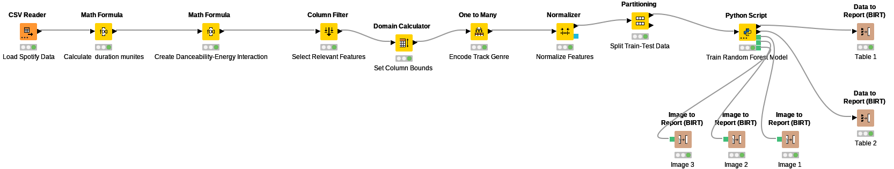

# Spotify Data Analysis Project

This project involves comprehensive data analysis of Spotify data using both Python (Jupyter Notebook) and KNIME. The objective is to uncover insights related to music trends, user listening behavior, and song popularity based on provided datasets.

## Project Overview

The project leverages two distinct implementations to predict song popularity and provide insightful visualizations:

1. **Python Implementation (Jupyter Notebook):**
   - Data preprocessing using Pandas
   - Feature engineering for improved model accuracy
   - XGBoost model training and evaluation
   - Visualization of feature importance using SHAP
   - Data insights visualization using Matplotlib and Seaborn
   - Interactive dashboard creation using JavaScript

   ### Dashboard Deployment:
   - The dashboard has been deployed on Vercel for interactive data exploration:
     [Spotify Data Analysis Dashboard](https://spotify-data-analysis-tau.vercel.app/)


2. **KNIME Workflow Implementation:**
   - Data ingestion using CSV Reader node
   - Data transformation using String to Number and Math Formula nodes
   - Feature engineering using Column Filter and One to Many nodes
   - Model training using XGBoost Learner node
   - Prediction generation using XGBoost Predictor node
   - Model evaluation using Scorer node
   - SHAP analysis using Python Script node
   - Data visualization using JavaScript nodes
   - Report generation using Data to Report and Report Designer nodes

   ### KNIME Workflow Structure:
   

   1. **Data Preprocessing:**
      - Load data using CSV Reader
      - Convert data types using String to Number
      - Generate `duration_min` and `danceability_energy` features using Math Formula

   2. **Feature Engineering:**
      - Select relevant features using Column Filter
      - Encode track genres using One to Many

   3. **Model Training and Evaluation:**
      - Partition data using Partitioning node
      - Train XGBoost model using XGBoost Learner
      - Generate predictions using XGBoost Predictor
      - Evaluate model performance using Scorer

   4. **SHAP Analysis:**
      - Compute SHAP values using Python Script node
      - Interpret feature importance

   5. **Data Visualization:**
      - Create scatter plot using JavaScript Scatter Plot node
      - Visualize artist popularity using JavaScript Bar Chart node
      - Generate summary report using Table to HTML node


## Key Features
- Data Extraction and Cleaning: Ensured data integrity and handled missing values effectively.
- Data Analysis: Performed exploratory data analysis to identify patterns and outliers.
- Data Visualization: Created informative visualizations to communicate key insights.
- Statistical Analysis: Analyzed correlations between song features and popularity metrics.

## Technologies Used
- Python
- Pandas
- Matplotlib
- Seaborn
- Jupyter Notebook
- KNIME


## How to Run

### Jupyter Notebook Implementation:
1. Clone the repository: `git clone <repository-link>`
2. Navigate to the project directory: `cd spotify-data-analysis`
4. Run the Jupyter notebook to perform analysis and view visualizations:
   ```bash
   jupyter notebook analyze_spotify.ipynb
   ```

### KNIME Workflow Implementation:
1. Open KNIME Analytics Platform.
2. Import the KNIME workflow from the repository:
   - File > Import KNIME Workflow > Select `workflow.knime`.
3. Verify data paths and adjust if necessary.
4. Execute the workflow from the **Data Ingestion** node.
5. All visualizations and reports will be generated and saved to the specified output directory.

**Note:** Ensure that all assets (CSV files, images) are properly linked within the KNIME workspace.

## Dataset
- The dataset includes various song attributes such as danceability, energy, tempo, and popularity scores. Data was extracted from Spotify using available datasets and APIs.

## Insights
- Identified top genres and their popularity over time.
- Analyzed the relationship between tempo and song popularity.
- Visualized trends in user listening behavior over months.

## Author
- Riddhi Jayswal

